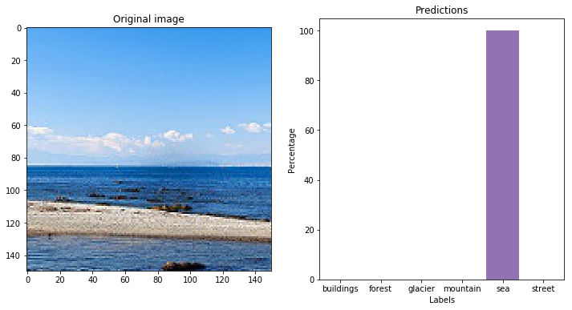

# Intel Scene Classification Challenge

The problem statement is available on [analytics vidhya](https://datahack.analyticsvidhya.com/contest/practice-problem-intel-scene-classification-challe/). The problem is to classify scene depicted in the image. Try out the jupyter notebook [here](https://colab.research.google.com/github/puneet29/IntelSceneClassification/blob/master/IntelImageClassification.ipynb) or the demo website: [intelclassify.herokuapp.com](https://intelclassify.herokuapp.com/). An example is given below



## Download the pretrained model

Download the pretrained model from [this google drive link](https://drive.google.com/open?id=1Q6e9wwovM0cACbiINI2crL9rgcbPtiSf) or download from the repository itself and paste it in the repo folder. You don't need to download the model if you use the given setup instructions. I have used RESNET-50 architecture and added two fully-connected layers at the end of the architecture.

### Setup

- Clone the repo.
- Run:
  ```bash
  pip install -r requirements.txt
  python3 setup.py
  ```

## Key step

Remove the mislabeled and confusing images from the dataset to increase the accuracy of the classifying the scenes.
